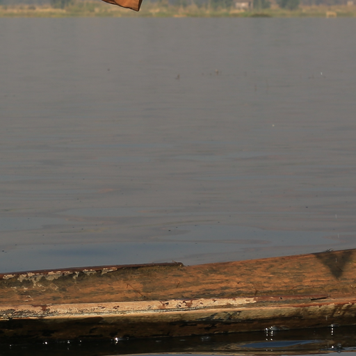
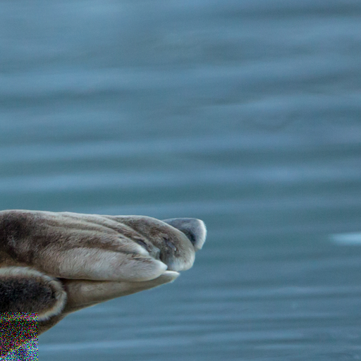
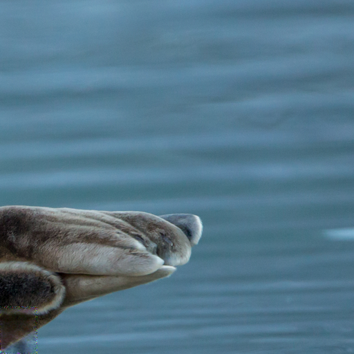
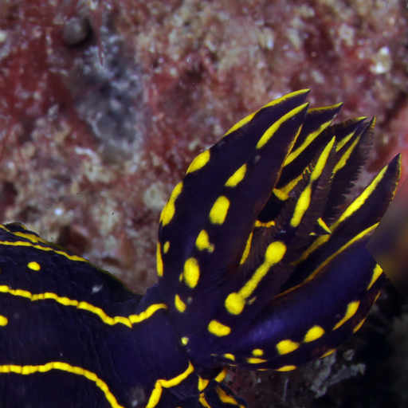
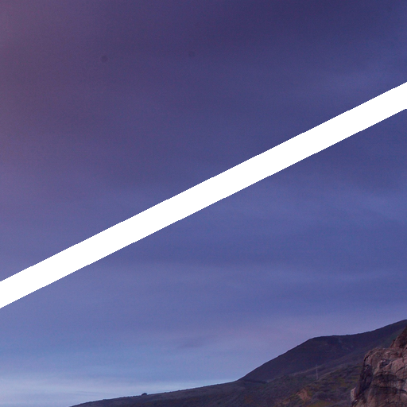
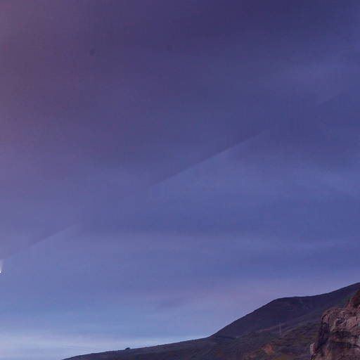
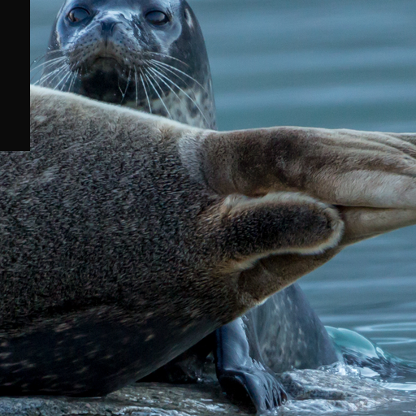
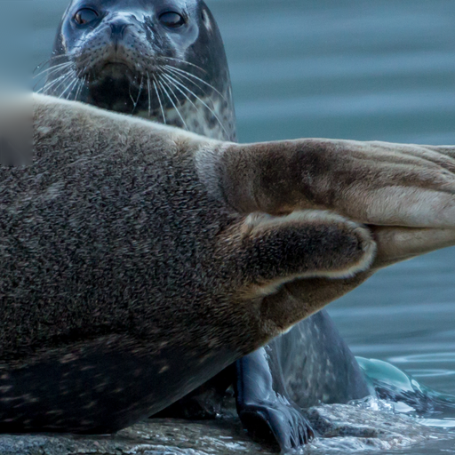
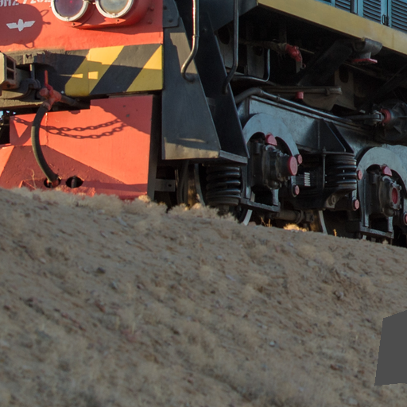
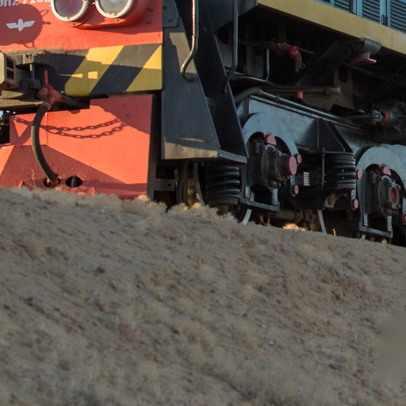

# 30B Multi-Specialist Image Restoration System

A modular image-restoration system that automatically detects image damage, classifies the damage type, localizes the damaged region, and routes the image to an appropriate restoration specialist.

## Capabilities

The system currently supports six routes:

| Damage type | Restoration method |
|---|---|
| Clean image | Preserve original |
| Noise | 30B fine-tuned Restormer denoiser |
| Blur | Fine-tuned Restormer deblur model |
| Scratch | OpenCV Navier-Stokes inpainting |
| Missing region | OpenCV Telea inpainting |
| Irregular missing region | OpenCV Telea inpainting |

The system also generates a predicted damage mask showing where damage was detected.

## System Architecture

```text
Input Image
    |
    v
28J Damage Detector
    |
    +---- No significant damage ----> Preserve Original
    |
    v
29A Damage Classifier
    |
    +---- Noise ----------> 30B Fine-tuned Restormer
    |
    +---- Blur -----------> 29B Fine-tuned Restormer
    |
    +---- Scratch --------> Navier-Stokes Inpainting
    |
    +---- Missing --------> Telea Inpainting
    |
    +---- Irregular ------> Telea Inpainting
    |
    v
Restored Image
```

## Main Models

The system uses four learned models:

1. **28J Damage Detector**
   - U-Net-style damage localization model
   - Trained to predict damaged image regions

2. **29A Damage Classifier**
   - Mask-aware ResNet18 classifier
   - Classes:
     - clean
     - noise
     - blur
     - scratch
     - missing
     - irregular

3. **29B Deblur Specialist**
   - Fine-tuned Restormer
   - Used for localized blur restoration

4. **30B Noise Specialist**
   - Fine-tuned Restormer
   - Improved to support a broader range of noise patterns

The system also uses OpenCV classical inpainting for scratches and missing regions.

## 30B Noise Upgrade

The original denoising branch used a pretrained blind Gaussian Restormer denoiser.

Testing showed that it struggled with some unseen noise patterns, particularly strong localized colored noise.

A new 30B Restormer noise specialist was therefore fine-tuned using a broader synthetic noise dataset containing:

- Gaussian noise
- colored RGB noise
- salt-and-pepper noise
- speckle noise
- Poisson noise
- JPEG artifacts
- localized colored noise
- mixed noise combinations

The selected checkpoint was from Epoch 3 with:

```text
Validation PSNR: 32.755 dB
```

## GUI

The project includes a Tkinter GUI with:

- image selection
- original image preview
- restored image preview
- predicted damage-mask preview
- detected damage type
- classifier confidence
- selected specialist
- damage-area percentage
- processing time
- output saving

Run the GUI with:

```powershell
python restoration_gui_30b.py
```

## Command-Line Usage

Example:

```powershell
python scripts/final_multispecialist_restoration_pipeline_30b.py `
    --input "example.png" `
    --output "restored.png" `
    --mask-output "mask.png" `
    --report "report.json"
```

## Project Structure

```text
genai-restoration-30b-production/
│
├── restoration_gui_30b.py
├── README.md
├── requirements.txt
├── THIRD_PARTY_NOTICES.md
├── .gitignore
│
├── scripts/
│   ├── final_multispecialist_restoration_pipeline_30b.py
│   ├── final_restoration_pipeline.py
│   ├── experiment_11c_train_improved_detector.py
│   ├── experiment_29a_4_predicted_mask_validation.py
│   └── experiment_29b_c2_development_benchmark.py
│
├── models/
│   ├── experiment_28j_release/
│   ├── experiment_29a_damage_classifier/
│   ├── experiment_29b_deblur_specialist/
│   └── experiment_30b_noise_specialist/
│
├── external/
│   └── Restormer/
│
├── demo_images/
│
└── example_results/
```

## Installation

Create a Python environment and install the dependencies:

```powershell
pip install -r requirements.txt
```

CUDA-enabled PyTorch is strongly recommended.

The system was developed and tested using an NVIDIA RTX GPU.

## Model Integrity

SHA256 hashes are used as digital fingerprints for important model and pipeline files.

The 30B denoiser checkpoint currently has:

```text
7f715c0b0afe714716bf7883db59e6730981783ab9691c828ca1c813cfa31c0f
```

Hashes are used to verify that the exact validated model files have not been changed.

## Validation

The packaged system has been manually smoke-tested across all six routes:

```text
Clean     -> Preserve
Noise     -> 30B Restormer
Blur      -> 29B Restormer
Scratch   -> Navier-Stokes
Missing   -> Telea
Irregular -> Telea
```

## Demo Results

The examples below show representative outputs from the six restoration routes.

### Clean Image

**Input**



**Restored**


**Predicted mask**


---

### Noise

**Input**



**Restored**



**Predicted mask**


---

### Blur

**Input**



**Restored**


**Predicted mask**


---

### Scratch

**Input**



**Restored**



**Predicted mask**


---

### Missing Region

**Input**



**Restored**



**Predicted mask**


---

### Irregular Missing Region

**Input**



**Restored**



**Predicted mask**


## Limitations

The system performs strongest on damage patterns similar to its training and validation distributions.

Performance on completely unseen real-world images can be less consistent because of domain shift.

The 30B upgrade improved generalization for unseen noise, but the system should still be considered a research and portfolio prototype rather than a universal photo-restoration solution.

Damage-mask accuracy can also affect restoration quality because the specialists operate primarily on regions identified by the detector.

## Third-Party Components

This project uses:

- Restormer
- OpenCV
- PyTorch
- Pillow

See `THIRD_PARTY_NOTICES.md` for attribution information.

## Portfolio Summary

This project demonstrates:

- computer vision
- image restoration
- semantic damage classification
- image segmentation
- transformer-based restoration
- transfer learning and fine-tuning
- classical computer vision
- modular AI-system design
- GPU model training
- validation and failure analysis
- GUI development
- model integrity verification
